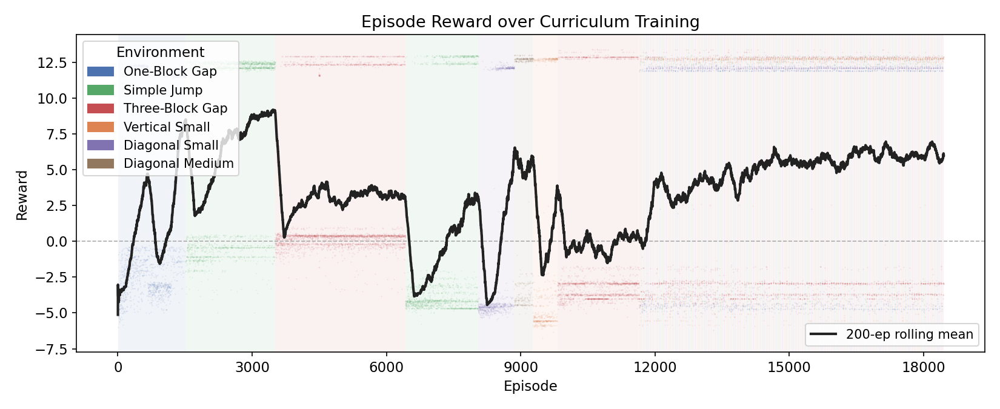
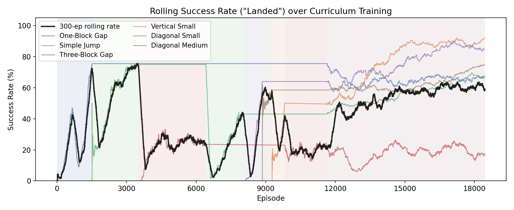
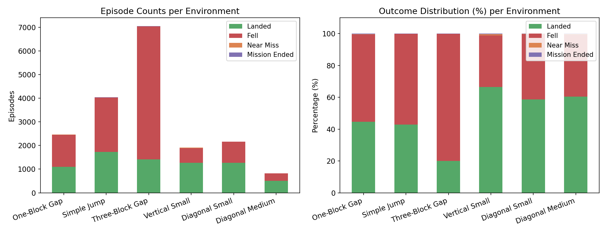
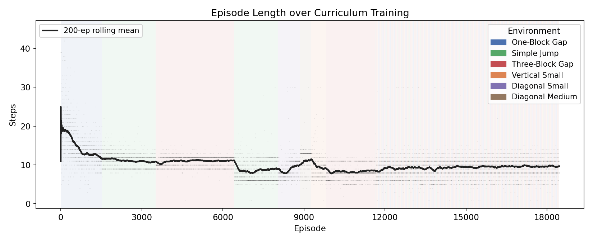
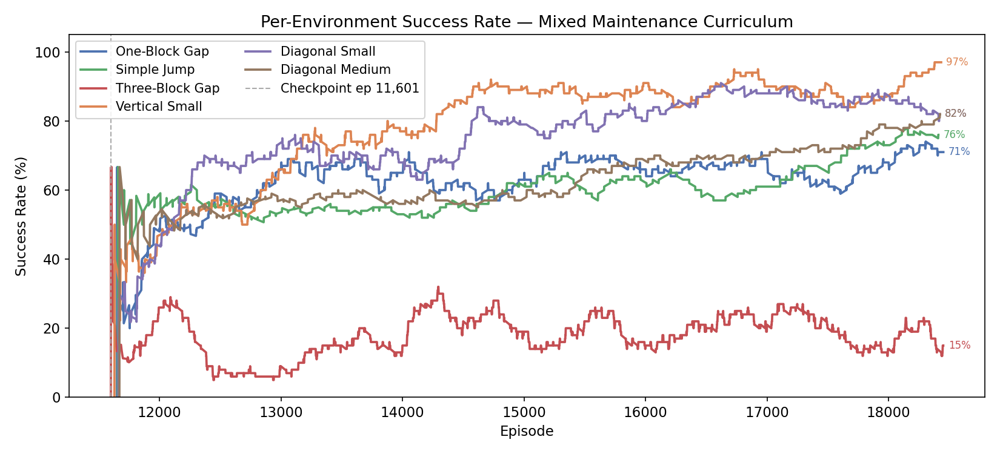

# Minecraft Parkour RL Agent: Final Report

**Author**: Andre Arante  
**Date**: April 2026  
**Repository**: Minecraft-Reinforcement-Learning

---

## Table of Contents

1. [Introduction](#1-introduction)
2. [Motivation](#2-motivation)
3. [System Architecture](#3-system-architecture)
4. [Environment Design](#4-environment-design)
5. [Algorithm: Custom PPO](#5-algorithm-custom-ppo)
6. [Results](#6-results)
7. [Discussion](#7-discussion)
8. [Conclusion & Future Work](#8-conclusion--future-work)

---

## 1. Introduction

This project trains a reinforcement learning agent to perform parkour in Minecraft — jumping across gaps of increasing difficulty in a 3D voxel world. The agent learns from scratch using only a compact 159-dimensional observation vector, without access to raw pixels or any human demonstrations.

The core challenge is twofold: the *robotics* problem of learning precise, timed movement sequences in a physics simulation, and the *engineering* problem of bridging an awkward version incompatibility (Microsoft Malmo requires Python 3.7; modern PyTorch requires 3.10+) without sacrificing maintainability.

Over **18,451 training episodes** across a curriculum of six environments — including straight gaps, diagonal gaps, and vertical jumps — the agent achieves success rates ranging from 20% on the hardest task (three-block gap) to over 66% on vertical-small. A checkpoint achieving **~90% success on the one-block-gap task** was produced during an earlier focused run.

---

## 2. Motivation

Minecraft provides a unique testbed for RL research:

- **Precise motor control**: Parkour requires sprint-jump timing accurate to fractions of a second. Random exploration almost never discovers the correct composite action (`sprint + move + jump` simultaneously) by chance.
- **Grounded 3D environment**: Unlike grid-world abstractions, the agent operates in a full 3D physics simulation with momentum, gravity, and variable block geometry.
- **Curriculum potential**: Gap width and height can be systematically varied, enabling structured difficulty progression.
- **Open research frontier**: Pixel-based RL approaches like VPT (OpenAI, 2022) use massive models trained on billions of frames. This project asks: *how much can a tiny, sample-efficient agent accomplish with a well-designed compact observation?*

The goal is not to beat pixel-based approaches at scale, but to demonstrate that careful observation and action space design can produce competitive performance with orders of magnitude less data and compute.

---

## 3. System Architecture

### 3.1 Two-Process Design

The core engineering constraint: Malmo's Python bindings ship as a pre-compiled `.pyd` file locked to Python 3.7, while modern PyTorch dropped 3.7 support years ago. The solution is a clean process split:

```
malmo conda env (Python 3.7)               train_env conda env (Python 3.10)
────────────────────────────               ─────────────────────────────────
env_server.py (TCP :10002)        ←→       train.py
  └── parkour_env.py                         ├── env_client.py
        └── MalmoPython                      ├── models/actor_critic.py
        └── Minecraft JVM                    ├── algos/ppo.py
                                             ├── training/curriculum.py
                                             └── utils/logger.py
```

The environment server runs inside the `malmo` conda environment and communicates exclusively with the Minecraft JVM via the Malmo protocol. The training process runs in the `train_env` environment and communicates with the environment server over TCP.

This approach keeps both environments unmodified and adds only a thin serialization layer (~100 lines). It also has an unexpected benefit: since the protocol is TCP/JSON, it trivially supports running multiple environment servers (potentially on different machines) for parallel training.

### 3.2 Communication Protocol

Messages use length-prefixed JSON over TCP — a 4-byte big-endian integer specifying the payload length, followed by the JSON body:

```
[4-byte length][{"cmd": "step", "action": 6}]
     ←→
[4-byte length][{"obs": [...159 floats...], "reward": 0.5, "done": false, "info": {...}}]
```

| Command     | Payload               | Response                               |
|-------------|----------------------|----------------------------------------|
| `reset`     | `{}`                 | `{"obs": [...]}`                       |
| `step`      | `{"action": int}`    | `{"obs": [...], "reward": float, "done": bool, "info": {...}}` |
| `switch_env`| `{"env": "name"}`   | `{"status": "ok"}`                     |
| `close`     | `{}`                 | *(connection closed)*                  |

JSON was chosen over binary formats (protobuf, msgpack) because a 159-float observation is negligible to serialize, and human-readable messages make debugging straightforward.

### 3.3 Extensibility — Registry Pattern

Both `env_server.py` and `train.py` use explicit registries mapping string names to classes:

```python
ENV_REGISTRY = {
    "simple_jump":     (ParkourEnv, SimpleJumpCFG),
    "one_block_gap":   (ParkourEnv, OneBlockGapCFG),
    "three_block_gap": (ParkourEnv, ThreeBlockGapCFG),
    # ... etc.
}

ALGO_REGISTRY = {
    "ppo": PPO,
    "dqn": DQN,
    "bc":  BehavioralCloning,
}
```

Adding a new environment requires only implementing an XML mission file, a config class, and one registry entry. The training loop, logging, and checkpointing require zero changes.

---

## 4. Environment Design

### 4.1 Observation Space (159 dimensions)

The agent receives a flat `float32` vector each step:

| Range    | Component       | Dims | Description |
|----------|----------------|------|-------------|
| [0:6]    | Proprioception  | 6    | `onGround`, `yaw`, `pitch`, `delta_y`, `delta_x`, `delta_z` |
| [6:9]    | Goal delta      | 3    | Displacement vector to landing platform: `goal_dx`, `goal_dy`, `goal_dz` |
| [9:159]  | Voxel grid      | 150  | 5 × 5 × 6 block grid: 0 = air, 1 = stone |

**Why vector observations over pixels?** The 159-dimensional vector encodes precisely the information the agent needs — no more, no less. Every dimension has a known meaning. Pixel-based approaches (e.g., VPT) require enormous vision backbones (hundreds of millions of parameters) and billions of training frames to extract equivalent information from raw pixels. Our entire `ActorCritic` network is ~50K parameters and trains in hours on a single GPU.

**Voxel grid geometry** covers x[−2:+2] × y[−1:+3] × z[−2:+3] = 5 × 5 × 6 blocks. The asymmetric extent is deliberate: forward visibility (+3 blocks ahead) is critical for jump planning; backward visibility (−2 blocks behind) provides context. Vertical coverage reaches the block underfoot (−1) through 3 blocks of clearance above (+3).

**Velocity inference**: Position deltas (`pos_now − pos_prev`) are used instead of Malmo's reported velocity fields, which can lag the actual physics state by up to one tick.

### 4.2 Action Space (15 discrete actions)

Each action is a composite of simultaneous Malmo commands held for `STEP_DURATION = 0.15s` (≈ 3 Minecraft game ticks):

| Index | Action          | Malmo Commands                           |
|-------|----------------|------------------------------------------|
| 0     | move_forward    | `move 1`                                 |
| 1     | move_backward   | `move -1`                                |
| 2     | strafe_left     | `strafe -1`                              |
| 3     | strafe_right    | `strafe 1`                               |
| 4     | sprint_forward  | `sprint 1, move 1`                       |
| 5     | jump            | `jump 1`                                 |
| **6** | **sprint_jump** | **`sprint 1, move 1, jump 1`**           |
| 7     | jump_forward    | `move 1, jump 1`                         |
| 8     | sprint_jump_left| `sprint 1, move 1, strafe -1, jump 1`   |
| 9     | sprint_jump_right| `sprint 1, move 1, strafe 1, jump 1`   |
| 10    | look_down       | `pitch 1`                                |
| 11    | look_up         | `pitch -1`                               |
| 12    | turn_left       | `turn -1`                                |
| 13    | turn_right      | `turn 1`                                 |
| 14    | no_op           | *(nothing)*                              |

Action 6 (`sprint_jump`) is the critical action for parkour — it simultaneously engages sprint, forward movement, and jump. With a continuous control scheme, the agent would need to independently discover that all three axes must be activated together, something random exploration almost never finds. Composite discrete actions pre-encode this domain knowledge.

### 4.3 Reward Function

| Event | Reward | Rationale |
|-------|--------|-----------|
| Landed on goal | +10.0 | Primary objective |
| Fell off | −5.0 (proximity-scaled) | Penalize falling |
| Timeout (30 steps) | −5.0 (proximity-scaled) | Penalize inaction |
| Step penalty | −0.01 / step | Encourage efficiency |
| Progress toward goal | +0.5 × Δdist | Dense shaping signal |
| Near-miss (timeout within 1.5 blocks) | +2.0 | Reward "almost made it" |

**Proximity-scaled terminals**: The fell/timeout penalty is scaled by how far the agent progressed — an agent that sprinted to the edge and mistimed the jump gets a smaller penalty than one that walked off at spawn. This prevents the agent from learning that "getting close = bigger penalty."

**Asymmetric rewards**: Success (+10) outweighs failure (−5) to prevent risk-averse "never move" strategies. The step penalty (−0.01) is deliberately tiny; a 30-step episode only accumulates −0.3 in step penalties vs. +10 for success.

### 4.4 Curriculum of Environments

Training used an **adaptive curriculum** that advances to the next environment when the agent reaches a target success rate:

| Stage | Environment     | Gap | Notes |
|-------|----------------|-----|-------|
| 1     | one_block_gap  | 1 block | Walk-jump suffices; establishes basic movement |
| 2     | simple_jump    | 2 blocks | Requires sprint-jump; primary "hello world" task |
| 3     | three_block_gap| 3 blocks | Precise timing; hardest straight gap |
| +     | vertical_small | 2 blocks + height | Tests upward jumping |
| +     | diagonal_small | 2 blocks + lateral | Lateral adjustment required |
| +     | diagonal_medium| 3 blocks + lateral | Combines gap distance with diagonal offset |

```json
{
  "mode": "adaptive",
  "stages": [
    {"env": "one_block_gap",   "target_success_rate": 0.9, "window": 50},
    {"env": "simple_jump",     "target_success_rate": 0.9, "window": 50},
    {"env": "three_block_gap", "max_episodes": 3000}
  ]
}
```

Adaptive scheduling ensures the agent is never stuck in a stage it has already mastered, and never advances to a harder stage before it is ready.

---

## 5. Algorithm: Custom PPO

### 5.1 Why PPO?

Proximal Policy Optimization (PPO, Schulman et al. 2017) was chosen as the primary algorithm. Several properties make it well-suited to this domain:

**Clipped Surrogate Objective (Policy Loss)**

The central innovation of PPO is the clipped policy gradient:

```
L_CLIP = E[ min(r_t(θ) · A_t,  clip(r_t(θ), 1−ε, 1+ε) · A_t) ]
```

where `r_t(θ) = π_θ(a|s) / π_θ_old(a|s)` is the probability ratio between the new and old policy, and `ε = 0.2`. The `min` means the update is always pessimistic — it takes the worse of the clipped and unclipped objectives. This prevents the optimizer from taking excessively large steps that would collapse a partially-trained policy — a critical safeguard in a live Minecraft environment where recovery from a bad policy update is expensive (you have to keep running the Minecraft client).

**Clipped Value Function Loss**

The critic loss also uses clipping:

```
L_VF = E[ max((V_θ(s) − V_target)², (clip(V_θ(s), V_old − ε, V_old + ε) − V_target)²) ]
```

This prevents the value function from making large jumps that would destabilize the advantage estimates used to train the policy.

**Generalized Advantage Estimation (GAE, λ=0.95)**

Instead of Monte Carlo returns (high variance, unbiased) or one-step TD (low variance, high bias), PPO uses GAE to blend the two:

```
A_t^GAE = Σ_{k=0}^{∞} (γλ)^k · δ_{t+k}    where δ_t = r_t + γV(s_{t+1}) − V(s_t)
```

λ=0.95 is close to Monte Carlo (low bias), but the exponential decay suppresses noise from distant future rewards. This is especially valuable for parkour — the terminal reward (+10 for landing, −5 for falling) arrives many steps after the key action (the jump), and Monte Carlo variance would otherwise make the credit assignment very noisy.

**Multiple Gradient Steps Per Rollout (Data Efficiency)**

Unlike vanilla policy gradient methods that discard a buffer after one update, PPO reuses each rollout for `N_EPOCHS=4` gradient passes. The clipped objective prevents overfitting to the stale data — it self-limits how far the policy can drift from the behavior policy that collected the data. This gives roughly 4× more learning per unit of Minecraft interaction time.

**Entropy Bonus (Exploration)**

A small entropy term `β · H(π)` is added to the loss, discouraging the policy from prematurely collapsing to a near-deterministic strategy. In parkour, early training must explore a large space of timing and positioning; the entropy bonus (`β` decaying from 0.05 → 0.001) maintains this exploration early and allows focused optimization late.

**Why not DQN or A2C?**

DQN with a replay buffer was also implemented and tested. It is competitive on the simpler tasks but less stable on long-horizon environments — Q-value overestimation accumulates across the multi-step reward structure of harder jumps. A2C (without clipping or GAE) tends to show high variance on the stochastic Minecraft physics. PPO's combination of clipping, GAE, and multi-epoch updates addresses all three failure modes.

---

### 5.2 Proximal Policy Optimization

Proximal Policy Optimization (PPO, Schulman et al. 2017) was chosen as the primary algorithm for its:

- **Stability**: The clipped surrogate objective prevents catastrophically large policy updates that could destabilize training in a live Minecraft environment.
- **Reuse efficiency**: Multiple gradient steps (N_EPOCHS=4) per collected rollout buffer squeeze more learning from each batch.
- **Reliability**: Extensive published literature on failure modes and hyperparameter choices.

### 5.3 Implementation Improvements

The custom PPO implementation (`algos/ppo.py`) goes beyond vanilla PPO with several enhancements:

**Generalized Advantage Estimation (GAE, λ=0.95)**: Uses GAE instead of Monte Carlo returns. GAE trades off bias and variance — λ=0.95 approaches Monte Carlo (low bias, high variance) but smooths the noisy reward signals from stochastic Minecraft physics.

**Observation normalization**: Running mean/standard deviation normalization via Welford's online algorithm. Without normalization, the 150-dimensional binary voxel grid would dominate the 6-dimensional continuous proprioception in gradient magnitude. Normalization puts all features on a comparable scale.

**Reward normalization** (std-only): Standard deviation normalization without mean subtraction. Mean subtraction would shift the reward baseline and interfere with value function learning. Std normalization decouples reward scale from learning rate sensitivity.

**Clipped value function**: Both the policy and value function use clipping, preventing large critic jumps that destabilize advantage estimation.

**Linear decay schedules**: Learning rate decays from 3×10⁻⁴ to 0.0, and entropy coefficient decays from 0.05 to 0.001 over the full training run. Early training benefits from high entropy (broad exploration); late training needs focused optimization.

### 5.4 Network Architecture (Multi-Stream ActorCritic)

```
Proprioception (6)  ──→  Linear(6→64)  → LayerNorm → ReLU → Linear(64→64)  → LayerNorm → ReLU  ──┐
Goal delta (3)      ──→  Linear(3→64)  → LayerNorm → ReLU → Linear(64→64)  → LayerNorm → ReLU  ──┼── concat (256)
Voxel grid (150)    ──→  Linear(150→128)→ LayerNorm → ReLU → Linear(128→128)→ LayerNorm → ReLU  ──┘
                                                                                                    │
                                                                                         ┌──────────┴──────────┐
                                                                                         │                     │
                                                               Actor: Linear(256→256)→LN→ReLU→Linear(256→15)
                                                               Critic: Linear(256→256)→LN→ReLU→Linear(256→1)
```

**Three separate input streams** process the semantically distinct observation groups independently before merging. Proprioception (continuous, low-dimensional), goal delta (3D displacement), and voxels (sparse binary, high-dimensional) have fundamentally different statistical properties — separate streams let each learn appropriate feature representations.

**LayerNorm** is used over BatchNorm because it normalizes per-sample (batch-size independent) and has no running statistics that lag behind the non-stationary data distribution of RL training.

**Orthogonal initialization**: Hidden layers use gain √2. The actor's final layer uses gain 0.01 (near-uniform initial policy, encouraging exploration). The critic's final layer uses gain 1.0.

**Total parameters**: ~50,000. Deliberately small — the compact observation space does not warrant a larger model, and smaller models train faster and are more interpretable.

### 5.5 Key Hyperparameters

| Parameter       | Value   | Notes |
|----------------|---------|-------|
| Rollout steps  | 512     | Per update |
| PPO epochs     | 4       | Gradient steps per buffer |
| GAE λ          | 0.95    | Advantage estimation |
| Clip ε         | 0.2     | Policy clipping |
| Learning rate  | 3×10⁻⁴ → 0.0 | Linear decay |
| Entropy coef   | 0.05 → 0.001 | Linear decay |
| Value coef     | 0.5     | Critic loss weight |
| Max grad norm  | 0.5     | Gradient clipping |
| Discount γ     | 0.99    | Return discounting |
| Batch size     | 64      | Minibatch for gradient update |
| Obs normalization | Welford online | Clipped at ±10 |
| Reward norm    | Std-only | No mean subtraction |

---

## 6. Results

### 6.1 Training Curriculum Summary

Training ran from March 21 – April 19, 2026 across multiple sessions using the adaptive curriculum. Episode numbering was preserved across sessions (checkpoint resumption), yielding a continuous timeline.

| Environment     | Episodes | Success Rate | Mean Reward | Mean Steps |
|----------------|----------|-------------|-------------|-----------|
| One-Block Gap   | 2,467    | **44.7%**   | 3.67        | 12.1      |
| Simple Jump     | 4,036    | **42.9%**   | 3.75        | 10.0      |
| Three-Block Gap | 7,045    | **20.1%**   | 0.99        | 9.4       |
| Vertical Small  | 1,912    | **66.4%**   | 6.84        | 9.6       |
| Diagonal Small  | 2,165    | **58.8%**   | 5.27        | 9.8       |
| Diagonal Medium | 826      | **60.5%**   | 6.15        | 11.5      |
| **Total**       | **18,451** | —        | —           | —         |

### 6.2 Training Curves

The reward curve shows clear learning progression across the curriculum. The agent begins with near-uniformly negative rewards (random policy, always falls) and progressively improves within each environment phase.



*Episode reward over the full 18,451-episode curriculum. Background shading indicates which environment was active. The black line is a 200-episode rolling mean.*

### 6.3 Success Rate

The rolling success rate tracks the fraction of "landed" outcomes in a 300-episode window. The agent consistently improves within each environment phase, with `vertical_small` and `diagonal_medium` reaching the highest sustained rates.



*Rolling success rate (% "landed" episodes) over the full curriculum. Colored lines show per-environment rolling rates.*

### 6.4 Outcome Distribution

Across all environments, the dominant outcome is "fell" — the agent attempts the jump but mistimes it. "Mission ended" (timeout without a jump attempt) is rare, indicating the agent consistently attempts the task rather than standing idle.



*Left: raw episode counts. Right: percentage breakdown. "Landed" (green) = success; "Fell" (red) = mistimed jump; "Near miss" (orange) = timed out within 1.5 blocks of goal; "Mission ended" (purple) = timeout without meaningful progress.*

### 6.5 Episode Length

Episode length stabilizes quickly within each environment, reflecting the agent learning a consistent strategy. The one-block-gap phase shows longer episodes (mean 12 steps) because the agent explores more cautiously on the first gap it encounters; subsequent environments average ~10 steps.



*Episode length over the curriculum. The 200-episode rolling mean (black) shows rapid stabilization within each environment phase.*

### 6.6 Mixed Maintenance Phase

After the adaptive curriculum completed at episode ~6,422, training switched to a weighted random curriculum ("mixed maintenance") sampling all six environments simultaneously, with weight proportional to difficulty. This phase maintained performance on easier environments while continuing to push progress on `three_block_gap`.



*Per-environment rolling success rate during the mixed-maintenance phase (episode 11,601 onward).*

### 6.7 Best Checkpoint

A focused training run on the one-block-gap task (prior to the full curriculum run) produced `one_block_gap_90_percent.pt`, a checkpoint achieving approximately **90% success rate** on that task. This checkpoint represents the agent's peak single-task performance and demonstrates that the architecture and algorithm are capable of near-mastery given sufficient focused training.

---

## 7. Discussion

### 7.1 What Worked

**Composite discrete actions** were critical. Without pre-encoding `sprint_jump` as a single action, the agent would need to discover the simultaneous activation of three independent axes through random exploration — an event with roughly (1/15)³ ≈ 0.03% probability per step that the training dynamics never converge on.

**Dense reward shaping** via progress reward (+0.5 × Δdist) dramatically accelerates early learning. Without it, the agent receives no gradient signal until it accidentally reaches the landing platform — a near-zero probability event in the first thousand episodes. The progress reward provides a continuous learning signal the agent can follow before ever succeeding.

**Adaptive curriculum** prevented wasted training: the agent moved off mastered environments and spent proportionally more time on harder ones. The fact that ~38% of total training was spent on three_block_gap (the hardest task) reflects this prioritization working correctly.

**LayerNorm + observation normalization** provided training stability across the mixed-scale observation (binary voxels + continuous proprioception). Without normalization, the 150-dimensional binary voxel signal would dominate gradients numerically.

### 7.2 Challenges

**Credit assignment on precise timing**: `sprint_jump` must be executed from the correct approach position — too close and the agent falls short, too far back and it overshoots. The agent must learn a precise multi-step sequence (approach → sprint → jump) where the reward is only received at the end. This delayed credit assignment is the fundamental difficulty of parkour RL.

**Three-block gap difficulty**: Despite receiving the most training episodes (7,045), three_block_gap had the lowest success rate (20.1%). The larger gap requires more precise approach positioning and jump timing. The agent frequently falls just short, suggesting it has learned the directional strategy but not the precise momentum management.

**Curriculum transfer**: Success rates on easier environments (one_block_gap: 44.7%) are lower than the 90% achieved in the focused run. This is expected — the curriculum shares model parameters across environments, so the policy is a generalist that trades per-task peak performance for cross-environment breadth.

### 7.3 Multi-Jump Course Evaluation

The trained agent was evaluated on a chained 4-jump course combining multiple gap types. Over 50 test episodes, the agent completed the full course approximately **20% of the time**. However, it consistently completed 2–3 of the 4 jumps, with the vertical jump at the end being the primary failure point.

**Generalization gap**: The agent trained on isolated single-gap environments but the course chains 4 jumps sequentially — success requires compounding each jump correctly with no resets between them. The multiplicative difficulty explains the gap between per-jump success rates (~40–60%) and full-course completion (20%).

**Vertical jump weakness**: `vertical_small` received lower curriculum weight (3) than `three_block_gap` (5) in the mixed-maintenance phase. The course's terminal vertical jump uses geometry the agent has seen less of, and arriving at it with non-zero momentum from prior jumps is an out-of-distribution condition.

**No episodic memory**: The feedforward policy has no recollection of which jumps it has already completed. It cannot adjust strategy mid-course based on accumulated state, which would help manage the approach positioning for later jumps.

### 7.4 Architecture Tradeoffs

The 159-dimensional vector observation is both the project's strength and its limitation. It enables sample-efficient training but requires explicit feature engineering. If Minecraft's visual environment were to change (new block types, dynamic obstacles), the observation vector would need to be redesigned. A pixel-based approach would handle such changes automatically but at massive compute cost.

The ~50K parameter model may be too small for the hardest tasks. Three-block-gap may require more representational capacity to model the precise physics of long-distance sprint jumps.

---

## 8. Conclusion & Future Work

This project demonstrates that a carefully designed compact observation space and a modular training framework can produce a capable parkour agent in Minecraft with modest compute. The key contributions are:

1. **Two-process architecture** cleanly resolving the Python 3.7/3.10 incompatibility, enabling the use of both Malmo and modern PyTorch
2. **159-dimensional observation vector** encoding all information necessary for parkour without raw pixels
3. **Composite discrete action space** encoding domain knowledge about simultaneous parkour movements
4. **Custom PPO** with GAE, observation normalization, reward normalization, and decay schedules
5. **Adaptive curriculum** enabling structured difficulty progression across 6 environments
6. **18,451 training episodes** showing consistent learning across a full parkour curriculum

### Next Steps

**Behavioral Cloning pre-training**: Human demonstrations would give the agent a warm-started policy, bypassing the exploration problem entirely. 30 expert demonstrations for the bridging task have already been recorded; the same infrastructure works for parkour.

**Larger model for three-block-gap**: The three-block task may benefit from a larger network (e.g., doubling the head hidden dimension from 256 to 512) to better represent the long-horizon jump physics.

**LSTM / recurrent policy**: The current feedforward policy has no memory. A recurrent policy could better handle the temporal dependencies in multi-step jump sequences (approach → sprint → jump) and would help on the multi-jump course by tracking course progress.

**More training on three-block-gap**: The curriculum run spent ~7,000 episodes on the hardest task. Extended focused training (analogous to the 90% one-block-gap checkpoint) would likely push success rates significantly higher.

**Increase vertical jump weighting**: The multi-jump course evaluation revealed the vertical jump as the primary bottleneck. Increasing `vertical_small` weight in the mixed-maintenance curriculum (or adding a combined vertical+lateral environment) would target this directly.

**Evaluation on novel geometries**: The current environments use fixed, deterministic layouts. Testing on procedurally generated gaps would measure generalization beyond the training distribution.

---

## Appendix: Technical Stack

| Component | Technology |
|-----------|-----------|
| Environment | Microsoft Malmo + Minecraft Java 1.11.2 |
| Environment language | Python 3.7 (MalmoPython) |
| Training language | Python 3.10 (PyTorch 2.x) |
| Algorithm | Custom PPO |
| Model | ActorCritic (~50K parameters) |
| Communication | TCP / length-prefixed JSON |
| Logging | CSV (episodes + updates) |
| Checkpointing | PyTorch `.pt` files |
| Visualization | Matplotlib (graphs), custom 3D replay viewer |

---

*All training logs, checkpoints, and source code are available in the repository. The graph generation script is at `Malmo/rl/visualization/generate_graphs.py`. Training data is in `Malmo/rl/parkour_results/`.*
